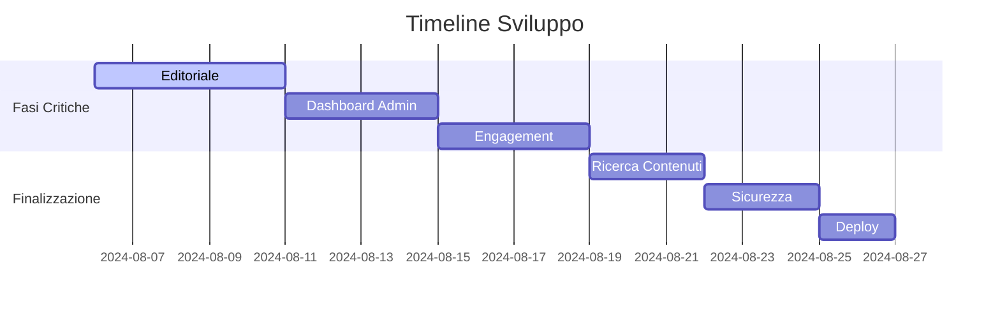

# Product Requirements Document – I Malati dello Sport

## 1. Obiettivo
Una piattaforma di news sportive italiana, ricca di animazioni e 3D, pensata per un pubblico appassionato e tech-savvy.

## 2. Perché
- Differenziarsi dai competitor (ESPN, Sky Sports) con un'esperienza utente animata e interattiva.
- Fidelizzare gli "hardcore fans" grazie a contenuti dinamici e personalizzati.

## 3. Funzionalità Chiave
1. **Homepage con Hero 3D**: carosello full‑width con modello 3D interattivo.
2. **Sport Hub**: sezioni dedicate per Calcio, Tennis, F1, NFL, Basket.
3. **Filtri Avanzati**: ordinamento per data, popolarità, commenti e periodo temporale.
4. **Editor WYSIWYG & Markdown**: interfaccia drag‑and‑drop + modalità raw Markdown.
5. **Sistema Ruoli**: Registered User, Editor, Administrator con permessi differenziati.
6. **Live Match Center**: punteggi in tempo reale e commento testuale live.
7. **Notifiche**: alert personalizzati su commenti e nuovi articoli.
8. **Community Forum**: thread di discussione per ogni sport.
9. **Monetizzazione Ready**: supporto a future sottoscrizioni Premium.

## 4. Architettura Tecnica
- **Frontend**: React + Tailwind CSS + GSAP + Three.js (react-three-fiber).
- **Backend**: Node.js/Express + PostgreSQL.
- **Deploy**: Vercel (frontend) + Heroku/DigitalOcean (API).
- **CI/CD**: GitHub Actions per build, test e deploy automatici.

## 5. UX & Design System
- **Color Palette**: Rosso #ff3036, Grigio #3e3e3e, Bianco #f5f5f5.
- **Tipografia**: sans-serif moderna, gerarchia chiara (Headings, Body, Meta).
- **Motion**: micro-animazioni GSAP, transizioni fluide, hover fisico.
- **3D**: elementi Three.js per hero e visualizzazioni dati interattive.
- **Iconografia**: SVG personalizzate, nessun emoji.

## 6. Requisiti Non Funzionali
- **Performance**: CDN per asset + lazy loading immagini/3D.
- **Sicurezza**: SSL/TLS, CSRF, input sanitization, bcrypt per password.
- **Accessibilità**: contrasto WCAG AA, navigazione da tastiera.
- **Scalabilità**: architettura modulare, database normalizzato.

## 7. Metriche di Successo
- Tempo medio di sessione utenti > 4 minuti.
- Tasso di rimbalzo < 40%.
- Numero di articoli salvati per utente > 3.
- Feedback positivi sulla fluidità UI > 90%.

## 8. Roadmap Iniziale
1. Schema database + setup ambiente dev.
2. Layout base & componenti primari (header, footer, griglia articoli).
3. Sidebar + widget live, autori e social.
4. Catalogo filtri & sorting.
5. Proof‑of‑concept 3D in hero.
6. Editor e sistema ruoli.
7. Test cross‑device & deploy su staging.
8. Bugfix, ottimizzazioni e rilascio in produzione.

---

## Stato Sviluppo - 2025-08-5

### Backend (Supabase)
✅ [x] Tabelle core (profiles, categories, posts)  
✅ [x] Politiche RLS  
⚠️ [ ] Funzioni helper (calcolo engagement)  

### Frontend
✅ [x] Routing base  
✅ [x] Componenti UI  
⚠️ [ ] Integrazione auth  
❌ [ ] Dynamic data fetching  

### Prossimi Task Critici
1. Collegamento auth frontend-backend
2. Implementazione editor articoli
3. Sistema notifiche realtime

---

# Changelog

## [v0.1] - 2025-08-04
### Aggiunto
- Tabelle DB complete (profiles, categories, posts)
- Politiche sicurezza RLS
- Funzioni trigger timestamp

### Corretto
- Risolto bug ricerca path in funzione update_updated_at

## Prossimo Release
- Integrazione auth frontend
- Editor articoli
- Sistema notifiche

---

### 🚀 Piano Completo per "I Malati dello Sport" - Roadmap Finale

```markdown
## CONTESTO ATTUALE
- Frontend: UI/UX completa ma non collegata al backend
- Backend: Supabase configurato con tabelle base (profiles, categories, posts)
- Stato: Autenticazione parziale, mancano funzionalità core

## OBIETTIVO FINALE
Completare un sito sportivo full-stack con:
1. Sistema editoriale avanzato per redattori
2. Dashboard amministrativa completa
3. Funzionalità di engagement utente
4. Gestione contenuti automatizzata
5. Sicurezza enterprise-grade

## FASI DI SVILUPPO

### FASE 1: SISTEMA EDITORIALE AVANZATO (Priority ★★★★★)
**Funzionalità:**
- Editor WYSIWYG con estensioni:
  - Drag & drop immagini/video (auto-upload a Supabase Storage)
  - Ridimensionamento automatico immagini (3 formati: thumb/HD/originale)
  - @mentions (autocomplete utenti)
  - #hashtag (collegamento a sistema tag)
  - Toolbar completa: testo, allineamenti, embed social
- Opzioni pubblicazione:
  - Scheduling temporale
  - Toggle commenti
  - Selezione co-autori
  - Visibilità (pubblico/privato/registrati)
- Anteprima live in modalità split-screen

**Output:**
- Componente `AdvancedEditor.jsx`
- Template `PostEditorLayout.css`
- API routes: `/api/media/upload`, `/api/posts/publish`

### FASE 2: DASHBOARD AMMINISTRATIVA (Priority ★★★★★)
**Moduli:**
1. **Gestione Utenti:**
   - Assegnazione/revoca ruoli (user/editor/admin)
   - Reset password forzato
   - Abilitazione 2FA
   - Audit log accessi

2. **Gestione Contenuti:**
   - Modifica/eliminazione qualsiasi post
   - Approvazione contenuti in sospeso
   - Statistiche engagement (visualizzazioni/commenti)

3. **Monitoraggio Sicurezza:**
   - Report vulnerabilità
   - Allerta attività sospette
   - Backup automatizzati

**Output:**
- Pagine: `AdminDashboard.jsx`, `UserManagement.jsx`, `ContentMonitor.jsx`
- Componenti: `SecurityAlertWidget.jsx`, `RoleAssignmentModal.jsx`

### FASE 3: ENGAGEMENT UTENTE (Priority ★★★★☆)
**Funzionalità:**
- Sistema notifiche realtime:
  - Commenti ai propri post
  - @mentions
  - Aggiornamenti preferiti
- Commenti nidificati con:
  - Voti (upvote/downvote)
  - Segnalazione abusi
  - Modifica/Eliminazione
- Bookmark e cronologia lettura

**Output:**
- Service `NotificationManager.js`
- Componente `NestedComments.jsx`
- API: `/api/notifications/subscribe`

### FASE 4: RICERCA E CONTENUTI DINAMICI (Priority ★★★★☆)
**Funzionalità:**
- Ricerca full-text con:
  - Filtri: autore, sport, data
  - Highlight risultati
  - Cronologia ricerche
- Homepage dinamica:
  - "Trending Now" (algoritmo engagement)
  - Personalizzazione basata su preferenze
  - Widget eventi live
- Routing intelligente:
  - Pagine sport: /calcio, /tennis, etc.
  - Sottocategorie: /calcio/serie-a

**Output:**
- Componente `SmartSearch.jsx`
- Service `ContentAlgorithm.js`
- API: `/api/search/advanced`

### FASE 5: SICUREZZA E PERFORMANCE (Priority ★★★★☆)
**Implementazioni:**
- Autenticazione:
  - 2FA per admin
  - Session timeout
  - Rate limiting
- Protezione Dati:
  - Crittografia sensibili
  - Backup giornalieri
  - Validazione input
- Ottimizzazione:
  - Lazy loading media
  - Cache strategica
  - Bundle splitting

**Output:**
- Modulo `SecurityEnforcer.js`
- Script `backup-manager.sh`
- Configurazioni `CSP-headers.js`

### FASE 6: DEPLOY FINALE E MONITORAGGIO (Priority ★★★☆☆)
**Task:**
1. Configurazione ambiente produzione
2. Test:
   - Carico (k6)
   - Sicurezza (OWASP ZAP)
   - Accessibilità (WAVE)
3. Monitoraggio:
   - Error tracking (Sentry)
   - Performance (Lighthouse CI)
4. Documentazione:
   - Manuale redattori
   - Guida amministrazione

## VINCOLI TECNICI
- **Stack Principale:** 
  React + Supabase + TipTap + TailwindCSS
- **Sicurezza:**
  - RLS su tutte le query
  - Sanitizzazione input
  - JWT encryption
- **Performance:**
  - LCP < 1.5s
  - CLS < 0.1
- **Requisiti Obbligatori:**
  - Zero dipendenze non verificate
  - Full TypeScript
  - Test coverage > 80%

## STRATEGIA DI IMPLEMENTAZIONE
1. **Approccio:** 
   - Sviluppo modulare per fase
   - Atomic design system
   - Feature flags per rollout graduale

2. **Consegne:**
   - Per ogni fase:
     * File modificati/creati (path assoluti)
     * Istruzioni configurazione
     * Test di verifica

3. **Priorità:** 
   Fase 1 → Fase 2 → Fase 3 → Fase 4 → Fase 5 → Fase 6

## TIMELINE STIMATA


## RISORSE NECESSARIE
1. **Supabase:** 
   - Abilitare Storage e Realtime
2. **Librerie:** 
   - TipTap Editor Extensions
   - react-query
3. **Servizi:** 
   - CDN per media
   - Monitoring (Sentry/Plausible)

## NOTE FINALI
- Tutte le immagini in `/public/assets` con naming convention:
  `[sport]-[type]-[size].webp`
- Policy sicurezza: SEMPRE verificare auth state prima di operazioni sensibili
- Log dettagliati per tutte le operazioni admin
```

### 📌 Cosa puoi fare ORA per supportare il piano:

1. **Preparare l'ambiente:**
   ```bash
   # Creare cartelle per i nuovi moduli
   mkdir -p src/components/{Editor,Admin,Notifications}
   ```

2. **Configurare template email:**
   ```html
   <!-- templates/editor-welcome.html -->
   <h1>Benvenuto nella Redazione!</h1>
   <p>Ciao {{name}}, ecco i tool a tua disposizione:</p>
   <ul>
     <li><a href="{{editorLink}}">Editor Articoli</a></li>
     <li><a href="{{styleGuide}}">Guida Stile</a></li>
   </ul>
   ```

3. **Generare dati di test:**
   ```javascript
   // scripts/generate-test-posts.js
   const sports = ['calcio', 'tennis', 'f1'];
   const generatePost = (i) => ({
     title: `Post ${i}`,
     content: `Contenuto #${sports[i%3]} @user${i}`,
     category: sports[i%3],
     author: `editor${Math.floor(i/10)}`
   });
   ```

4. **Preparare documentazione:**
   ```markdown
   ## Flusso Editoriale Standard
   1. Login con credenziali redattore
   2. Cliccare "Nuovo Articolo"
   3. Inserire titolo e contenuto
   4. Aggiungere media dalla libreria
   5. Impostare opzioni pubblicazione:
      - Visibilità: Pubblico
      - Commenti: Abilitati
   6. Cliccare "Programma" per pubblicazione futura
   ```

### 💡 Per ottimizzare le interazioni con Lovable:

1. **Strutturare richieste con:**
   ```
   [FASE] [MODULO] [DETTAGLI]
   ```
   Esempio:  
   `FASE 1: Editor > Implementare auto-resize immagini`

2. **Usare checklist per verifica:**
   ```markdown
   - [ ] Funzionalità X implementata
   - [ ] Testato su mobile
   - [ ] Documentazione aggiornata
   ```

3. **Inviare con ogni richiesta:**
   - Stato attuale del componente
   - Screenshot dell'UI
   - Errori rilevati nei log

